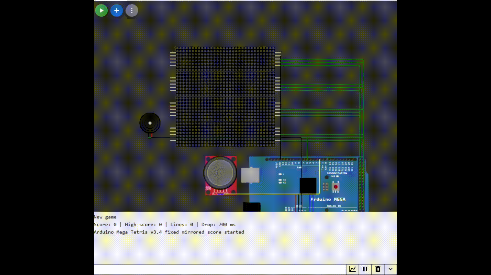

# Arduino Mega 32x32 Tetris

A fully working Tetris game for **Arduino Mega** and a **32x32 MAX7219 LED matrix**.

The project runs in **Wokwi** and uses a joystick for controls, a buzzer for sound effects, and EEPROM for saving the high score.

## Demo



## Features

- 32x32 MAX7219 LED matrix
- Classic 10x20 Tetris playfield
- Next piece preview
- Score display
- Joystick controls
- Soft drop and hard drop
- Piece rotation with simple wall kick
- 7-bag tetromino randomizer
- Buzzer sound effects
- EEPROM high score saving
- Wokwi simulation

## Controls

| Action | Control |
|---|---|
| Move left / right | Joystick left / right |
| Soft drop | Joystick down |
| Hard drop | Joystick up |
| Rotate piece | Joystick button |
| Restart after game over | Joystick button |
| Reset high score | Send `R` in Serial Monitor |

## Hardware

- Arduino Mega 2560
- 16x MAX7219 8x8 LED matrix modules
- Analog joystick
- Buzzer

## Pins

| Component | Arduino Mega Pin |
|---|---|
| MAX7219 DIN | 51 |
| MAX7219 CLK | 52 |
| Matrix row 0 CS | 53 |
| Matrix row 1 CS | 49 |
| Matrix row 2 CS | 48 |
| Matrix row 3 CS | 47 |
| Joystick VERT | A0 |
| Joystick HORZ | A1 |
| Joystick SEL | 2 |
| Buzzer | 6 |

## Files

```text
sketch.ino      Arduino code
diagram.json    Wokwi circuit
media/demo.gif  Demo animation
```

## Run in Wokwi

1. Create an Arduino Mega project in Wokwi.
2. Copy `sketch.ino`.
3. Copy `diagram.json`.
4. Start the simulation.

## License

MIT License.
